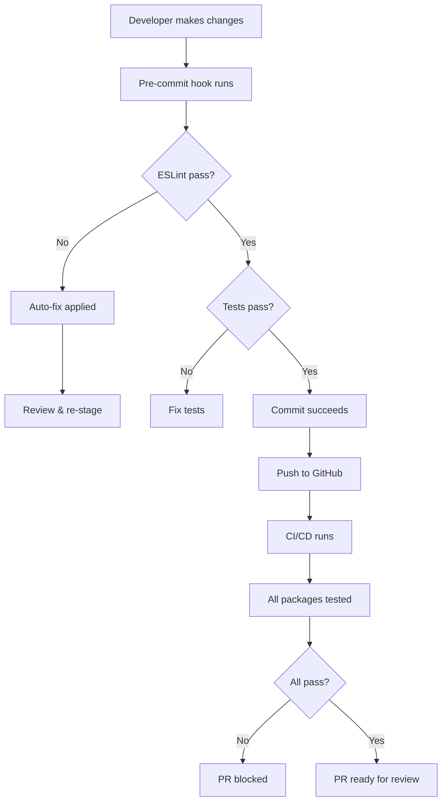

# Monorepo Architecture

This document provides a comprehensive overview of the monorepo structure, tooling, and design decisions. This is essential reading for both humans and AI assistants working on the project.

## Table of Contents

- [Overview](#overview)
- [Technology Stack](#technology-stack)
- [Monorepo Structure](#monorepo-structure)
- [Package Relationships](#package-relationships)
- [Build & Development Flow](#build--development-flow)
- [Testing Strategy](#testing-strategy)
- [CI/CD Pipeline](#cicd-pipeline)
- [Versioning & Publishing](#versioning--publishing)
- [Design Decisions](#design-decisions)

## Overview

This monorepo contains 9 independent npm packages focused on developer tooling for Node.js projects. Each package solves a specific problem in the JavaScript development workflow, from git operations to dependency management.

**Monorepo Goals:**
- Share common development tooling (linting, testing, CI/CD)
- Enable code reuse between packages
- Simplify dependency management
- Ensure consistent quality standards
- Enable atomic commits across related changes
- Streamline release coordination

## Technology Stack

### Core Tools

| Tool | Version | Purpose |
|------|---------|---------|
| **Node.js** | 20.19 | Runtime environment |
| **Yarn** | 4.9.1 | Package manager with PnP |
| **Lerna** | 4.0.0 | Monorepo orchestration |
| **Jest** | 29.x | Testing framework |
| **ESLint** | 8.x | Code linting |
| **Prettier** | Latest | Code formatting |

### Why These Choices?

**Lerna 4.0.0:**
- Independent versioning mode for flexibility
- Powerful package filtering (`--scope`, `--since`)
- Excellent npm publishing workflow
- Good integration with Yarn workspaces

**Yarn 4 with Plug'n'Play:**
- Faster installs (no node_modules)
- Reduced disk space
- Better dependency resolution
- Zero-installs capable (all deps in `.yarn/cache`)

**Jest 29:**
- Fast parallel test execution
- Built-in coverage reporting
- Great watch mode for development
- Familiar API and wide adoption

## Monorepo Structure

```
oss-projects/
├── .claude/                    # AI-assisted development configuration
│   ├── commands/               # Custom slash commands for Claude Code
│   │   ├── new-package.md
│   │   ├── test-package.md
│   │   ├── publish-package.md
│   │   ├── analyze-deps.md
│   │   ├── improve-coverage.md
│   │   └── update-docs.md
│   ├── hooks/
│   │   └── session_start.sh    # Auto-runs on Claude Code session start
│   └── project_context.md      # Project overview for AI assistants
│
├── .github/
│   ├── ISSUE_TEMPLATE/         # Issue templates
│   │   ├── bug_report.md
│   │   ├── feature_request.md
│   │   └── improvement.md
│   ├── workflows/              # GitHub Actions CI/CD
│   │   ├── build-test-deploy.yml
│   │   ├── dependabot-prs.yml
│   │   ├── ai-pr-summary.yml
│   │   └── test-coverage-report.yml
│   └── PULL_REQUEST_TEMPLATE.md
│
├── .husky/                     # Git hooks
│   └── pre-commit              # Runs lint + tests before commit
│
├── .templates/                 # Package scaffolding templates
│   └── package-template/
│       ├── package.json
│       ├── README.md
│       ├── index.js
│       └── __tests__/
│
├── .yarn/                      # Yarn PnP and SDKs
│   ├── cache/                  # Dependency cache (PnP)
│   ├── releases/               # Yarn binary
│   └── sdks/                   # IDE integrations (ESLint, Prettier)
│
├── packages/                   # All publishable packages
│   ├── convert-css/
│   ├── gen-changelogs/
│   ├── get-all-dependencies/
│   ├── lerna-utils/
│   ├── node-git-utils/
│   ├── npm-link-extra/
│   ├── safe-add-commit-changes/
│   ├── tag-dir-with-version/
│   └── workspaces-utils/
│
├── reports/                    # Generated test and coverage reports
│   └── coverage/
│
├── .eslintrc.js                # ESLint configuration (root)
├── .prettierrc.js              # Prettier configuration
├── .yarnrc.yml                 # Yarn 4 configuration
├── jest.config.js              # Jest configuration (root)
├── lerna.json                  # Lerna configuration
├── package.json                # Root package.json (workspaces)
├── .nvmrc                      # Node version specification
├── ARCHITECTURE.md             # This file
├── CONTRIBUTING.md             # Contribution guidelines
└── README.md                   # Project overview
```

## Package Relationships

### Dependency Graph

```
Independent Utilities (No internal deps):
├── convert-css              [CSS parsing → JSON/JS]
├── tag-dir-with-version     [Template versioning]
└── safe-add-commit-changes  [Safe git commits]

Git Utilities:
└── node-git-utils           [Git operations as JS]
    └── safe-add-commit-changes (uses this internally)

Monorepo Utilities:
├── lerna-utils              [Lerna API wrappers]
│   └── get-all-dependencies (uses this)
│
├── workspaces-utils         [Yarn workspace helpers]
│
└── get-all-dependencies     [Dependency analysis]
    └── (uses both lerna-utils and workspaces-utils)

Development Tools:
├── gen-changelogs           [Conventional commits → CHANGELOG]
│   └── (uses node-git-utils)
│
└── npm-link-extra           [Enhanced module linking]
    └── (uses workspaces-utils)
```

### Package Categories

**1. CSS Utilities**
- `convert-css`: Parse CSS and convert to JSON or JavaScript modules

**2. Git Utilities**
- `node-git-utils`: Git operations as JavaScript functions
- `safe-add-commit-changes`: Safe automation for git commits

**3. Monorepo Utilities**
- `lerna-utils`: Utility functions for Lerna
- `workspaces-utils`: Utility functions for Yarn workspaces
- `get-all-dependencies`: Analyze upstream/downstream dependencies

**4. Development Tools**
- `gen-changelogs`: Generate/update changelogs from conventional commits
- `npm-link-extra`: Enhanced module linking with `nlx` CLI
- `tag-dir-with-version`: Update template placeholders with package info

## Build & Development Flow

### Development Workflow



### Key Commands

```bash
# Development
yarn test              # Test changed packages
yarn test:all          # Test all packages
yarn lint              # Lint changed packages with auto-fix
yarn lint:all          # Lint all packages

# Documentation
yarn update:docs       # Generate JSDoc for changed packages

# Versioning
yarn bump:prerelease   # Bump versions with conventional commits

# Package Management
lerna bootstrap        # Install and link all packages
lerna add <pkg>        # Add dependency
lerna run <script>     # Run script in all packages
lerna list             # List all packages
```

## Testing Strategy

### Coverage Requirements

Every package must maintain **minimum 80% coverage** for:
- Branches (if/else, switch cases)
- Functions (all declared functions)
- Lines (executable code lines)
- Statements (all statements)

### Test Organization

```
packages/<package-name>/
└── __tests__/
    ├── index.test.js        # Main functionality tests
    ├── feature1.test.js     # Feature-specific tests
    └── integration.test.js  # Integration tests (if needed)
```

### Test Patterns

**Unit Tests:** Test individual functions in isolation
```javascript
describe('functionName', () => {
  it('should handle valid input', () => {});
  it('should throw on invalid input', () => {});
  it('should handle edge cases', () => {});
});
```

**Integration Tests:** Test package interactions
```javascript
describe('package integration', () => {
  it('should work with other packages', () => {});
});
```

### Running Tests

- **Locally:** Tests run on changed packages only (`--since`)
- **Pre-commit:** Tests run for affected packages
- **CI:** All packages tested on every push
- **Coverage:** Generated in `reports/coverage/`

## CI/CD Pipeline

### GitHub Actions Workflows

**1. build-test-deploy.yml**
- **Trigger:** Push to main, PRs, manual
- **Steps:**
  1. Checkout with full git history
  2. Setup Node.js 20.19
  3. Install dependencies (with cache)
  4. Lint all packages
  5. Test all packages
  6. Publish to npm (release branches only)

**2. dependabot-prs.yml**
- **Trigger:** Dependabot PRs
- **Steps:** Install → Lint → Test

**3. ai-pr-summary.yml** *(New)*
- **Trigger:** PR opened/updated
- **Action:** Comments with AI-generated summary of changes

**4. test-coverage-report.yml** *(New)*
- **Trigger:** PR opened/updated
- **Action:** Comments with coverage report and threshold checks

### Dependabot Configuration

- **Schedule:** Weekly updates
- **Strategy:** Increase versions (patch/minor only)
- **Ignored:** Major version updates (manual review required)

## Versioning & Publishing

### Independent Versioning

Each package has its own version number, allowing:
- Packages to evolve at different rates
- Breaking changes in one package without affecting others
- Clearer changelog per package

### Release Process

1. **Version bump:** `lerna version` analyzes conventional commits
2. **Git tags:** Automatically created (`<package>@<version>`)
3. **Changelogs:** Generated/updated per package
4. **Publish:** `lerna publish from-git`
5. **npm:** Packages published with public access

### Conventional Commits

All commits follow the format:
```
<type>(<scope>): <description>

[optional body]

[optional footer]
```

This enables:
- Automated version bumping (semver)
- Automated changelog generation
- Clear git history

## Design Decisions

### Why Monorepo?

**Benefits:**
- Single source of truth for all packages
- Shared tooling reduces duplication
- Cross-package refactoring is atomic
- Simplified dependency updates
- Consistent standards enforcement

**Tradeoffs:**
- Larger repo size
- More complex CI (test all packages)
- Need monorepo tooling (Lerna)

### Why No TypeScript?

**Current approach:**
- JavaScript ES2020 with JSDoc types
- Lower barrier to contribution
- No build step required
- Packages are small and well-tested

**Future consideration:**
- Could add `.d.ts` type definitions
- Could migrate incrementally
- Would improve IDE experience

### Why Yarn PnP?

**Advantages:**
- Faster installs (no file copying)
- Deterministic resolution
- Reduced disk usage
- Better security (no symlinks)

**Challenges:**
- IDE integration requires SDKs
- Some tools don't support PnP
- Learning curve for contributors

### Why Independent Versioning?

**Rationale:**
- Packages serve different purposes
- Users only install what they need
- Easier to understand package changes
- Allows experimentation in some packages

**Alternative:**
- Fixed versioning (all packages same version)
- Simpler but less flexible

## AI-Assisted Development

This monorepo is optimized for AI pair programming:

### Claude Code Integration

- **Session hooks:** Auto-initialize environment
- **Custom commands:** Streamlined workflows
- **Project context:** AI understands architecture
- **Templates:** Rapid package scaffolding

### Continuous Improvement

The AI setup enables:
- Automated test coverage improvements
- Dependency analysis and optimization
- Documentation generation and updates
- Code quality enhancements
- Rapid prototyping of new packages

### Best Practices for AI Collaboration

1. **Use slash commands** for common tasks
2. **Reference this document** for architecture questions
3. **Follow existing patterns** when adding features
4. **Maintain test coverage** at 80%+
5. **Update documentation** when APIs change

## Future Enhancements

Potential improvements tracked in issues:

- [ ] Add TypeScript type definitions
- [ ] Implement automated semantic releases
- [ ] Create package dependency visualization
- [ ] Add automated security scanning
- [ ] Optimize CI/CD performance (parallel testing)
- [ ] Add integration tests between packages
- [ ] Improve documentation with more examples
- [ ] Add performance benchmarks

---

**Document Version:** 1.0.0
**Last Updated:** 2025-11-08
**Maintained By:** AI-assisted development team
